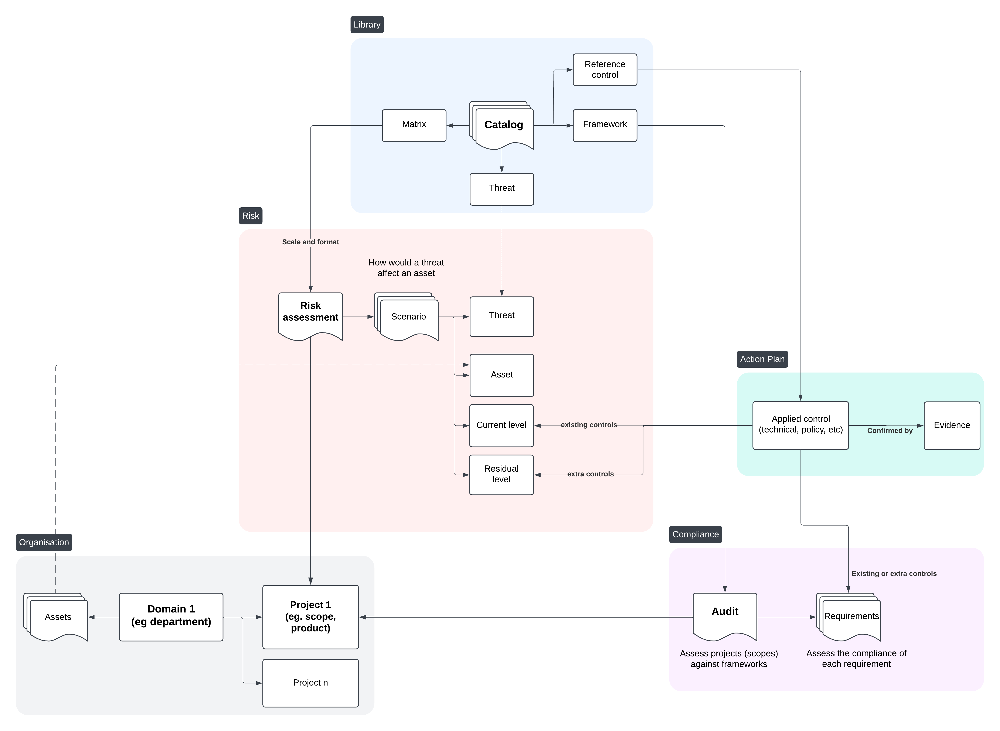
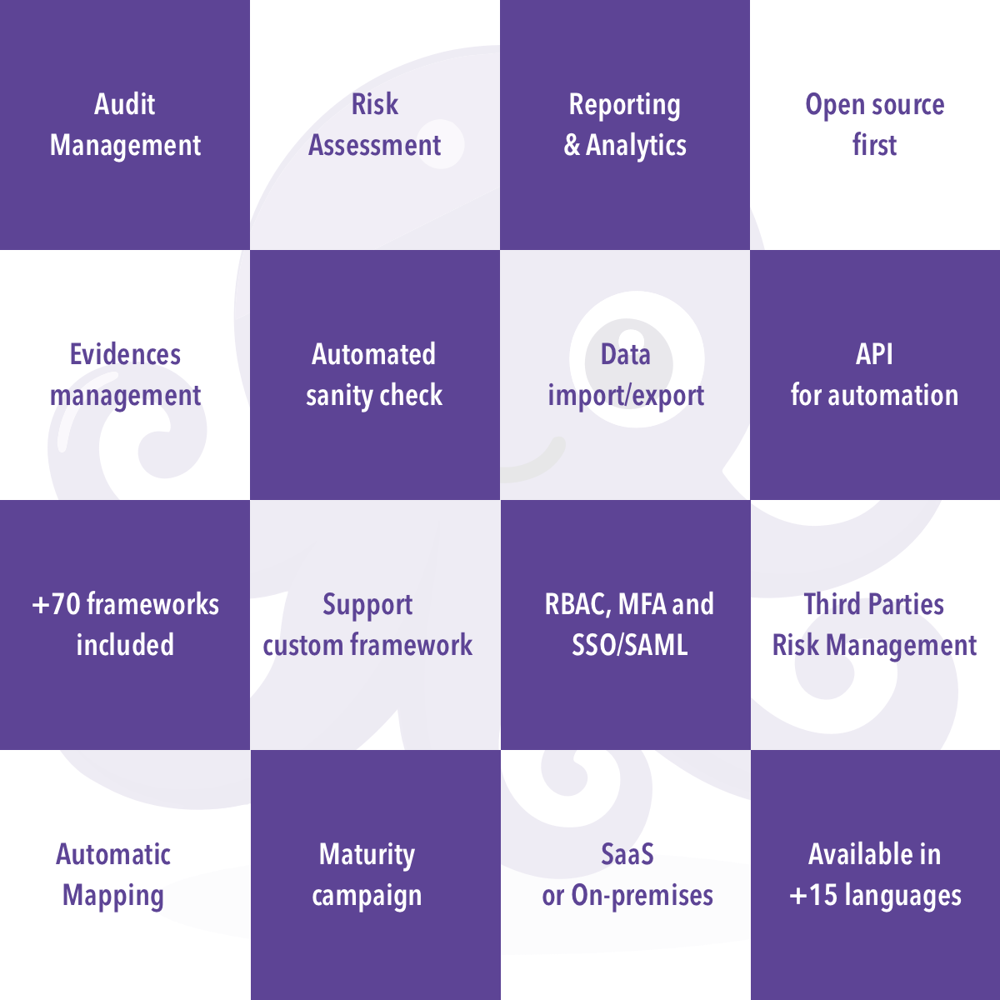

<p align="center">
Star the project 🌟 to get releases notification and help growing the community!
</p>

<p align="center">


Auditrex brings a different take to **GRC** and Cyber Security Posture Management:

- by explicitly decoupling compliance from cybersecurity controls implementation
- has built-in standards, security controls and threats
- risk assessment and remediation plan follow-up
- allows to manage a catalog for security controls and threats
- you can bring your own framework as well using a simple syntax
- manage audit, evidences collection and report generation


[](https://www.codefactor.io/repository/github/intuitem/ciso-assistant-community)
[](https://github.com/intuitem/ciso-assistant-community/actions/workflows/backend-api-tests.yml)
[](https://github.com/intuitem/ciso-assistant-community/actions/workflows/functional-tests.yml)

[](https://app.fossa.com/projects/git%2Bgithub.com%2Fab-smith%2Fciso-assistant-community?ref=badge_small)

Our vision is to provide a one stop shop for cyber security posture management and cover the layers of **GRC** (Governance, Risk and Compliance). As practitioners interacting with multiple cybersecurity and IT professionals, we have struggled with fragmentation and lack of efficient tooling. We keep improving Auditrex with anything that could bring clarity and productivity to cybersecurity teams and reduce the effort of research, audit management and paperwork.

CyberSecurity teams need to use GRC as a foundation to structure their program and implement the right tools and processes to mitigate the risks, and leave the rest to Auditrex 🐙

The vision of the tool is based on these fundamental objects:



There are other concepts and models to provide other features.

The decoupling concept is a pillar of the app and allows you to save a considerable amount of time:

- reuse previous assessments,
- assess a scope against multiple frameworks at the same time,
- leave the reporting formatting and sanity check to Auditrex and focus on your fixes,
- balance controls implementation and compliance follow-up


## System architecture


## Features

Here is an overview of Auditrex features and capabilities:




## Quick Start 🚀

once you have _Docker_ and _Docker-compose_ installed, on your workstation or server:

clone the repo:

```
git clone https://github.com/OCTO-Hurricane/Auditrex.git
```

and run the starter script

```sh
./docker-compose.sh
```

> [!NOTE]
> The docker-compose script uses prebuilt Docker images supporting most of the standard hardware architecture.
> If you're using **Windows**, Make sure to have [WSL](https://learn.microsoft.com/en-us/windows/wsl/install) installed and trigger the script within a WSL command line. It will feed Docker Desktop on your behalf.

The docker compose file can be adjusted to pass extra parameters to suit your setup (e.g. Mailer settings).

> [!WARNING]
> If you're getting warnings or errors about image's platform not matching host platform, raise an issue with the details and we'll add it shortly after. You can also use `docker-compose-build.sh` instead (see below) to build for your specific architecture.

> [!CAUTION]
> Don't use the `main` branch code directly for production as it's the merge upstream and can have breaking changes during our development. Either use the `tags` for stable versions or prebuilt images.

## Supported frameworks 🐙

1. ISO 27001:2022 🌐
2. NIST Cyber Security Framework (CSF) v1.1 🇺🇸
3. NIST Cyber Security Framework (CSF) v2.0 🇺🇸
4. NIS2 🇪🇺
5. SOC2 🇺🇸
6. PCI DSS 4.0 💳
7. CMMC v2 🇺🇸
8. PSPF 🇦🇺
9. General Data Protection Regulation (GDPR): Full text and checklist from GDPR.EU 🇪🇺
10. Essential Eight 🇦🇺
11. NYDFS 500 with 2023-11 amendments 🇺🇸
12. DORA (Act, RTS, ITS and GL) 🇪🇺
13. NIST AI Risk Management Framework 🇺🇸🤖
14. NIST SP 800-53 rev5 🇺🇸
15. France LPM/OIV rules 🇫🇷
16. CCB CyberFundamentals Framework 🇧🇪
17. NIST SP-800-66 (HIPAA) 🏥
18. HDS/HDH 🇫🇷
19. OWASP Application Security Verification Standard (ASVS) 🐝🖥️
20. RGS v2.0 🇫🇷
21. AirCyber ✈️🌐
22. Cyber Resilience Act (CRA) 🇪🇺
23. TIBER-EU 🇪🇺
24. NIST Privacy Framework 🇺🇸
25. TISAX (VDA ISA) v5.1 and v6.0 🚘
26. ANSSI hygiene guide 🇫🇷
27. Essential Cybersecurity Controls (ECC) 🇸🇦
28. CIS Controls v8\* 🌐
29. CSA CCM (Cloud Controls Matrix)\* ☁️
30. FADP (Federal Act on Data Protection) 🇨🇭
31. NIST SP 800-171 rev2 (2021) 🇺🇸
32. ANSSI : recommandations de sécurité pour un système d'IA générative 🇫🇷🤖
33. NIST SP 800-218: Secure Software Development Framework (SSDF) 🖥️
34. GSA FedRAMP rev5 ☁️🇺🇸
35. Cadre Conformité Cyber France (3CF) v1 (2021) ✈️🇫🇷
36. ANSSI : SecNumCloud ☁️🇫🇷
37. Cadre Conformité Cyber France (3CF) v2 (2024) ✈️🇫🇷
38. ANSSI : outil d’autoévaluation de gestion de crise cyber 💥🇫🇷
39. BSI: IT-Grundschutz-Kompendium 🇩🇪
40. NIST SP 800-171 rev3 (2024) 🇺🇸
41. ENISA: 5G Security Controls Matrix 🇪🇺
42. OWASP Mobile Application Security Verification Standard (MASVS) 🐝📱
43. Agile Security Framework (ASF) - baseline - by intuitem 🤗
44. ISO 27001:2013 🌐 (For legacy and migration)
45. EU AI Act 🇪🇺🤖
46. FBI CJIS 🇺🇸👮
47. Operational Technology Cybersecurity Controls (OTCC) 🇸🇦
48. Secure Controls Framework (SCF) 🇺🇸🌐
49. NCSC Cyber Assessment Framework (CAF) 🇬🇧
50. California Consumer Privacy Act (CCPA) 🇺🇸
51. California Consumer Privacy Act Regulations 🇺🇸
52. NCSC Cyber Essentials 🇬🇧
53. Directive Nationale de la Sécurité des Systèmes d'Information (DNSSI) Maroc 🇲🇦
54. Part-IS ✈️🇪🇺
55. ENS Esquema Nacional de seguridad 🇪🇸
56. Korea ISA ISMS-P 🇰🇷
57. Swiss ICT minimum standard 🇨🇭
58. Adobe Common Controls Framework (CCF) 🌐
59. BSI Cloud Computing Compliance Criteria Catalogue (C5) 🇩🇪
60. Référentiel d’Audit de la Sécurité des Systèmes d’Information, ANCS Tunisie 🇹🇳
61. ECB Cyber resilience oversight expectations for financial market infrastructures 🇪🇺
62. Mindeststandard-des-BSI-zur-Nutzung-externer-Cloud-Dienste (Version 2.1) 🇩🇪
63. Formulaire d'évaluation de la maturité - niveau fondamental (DGA) 🇫🇷
64. NIS2 technical and methodological requirements 2024/2690 🇪🇺
65. Saudi Arabian Monetary Authority (SAMA) Cybersecurity Framework 🇸🇦
66. Guide de sécurité des données (CNIL) 🇫🇷
67. International Traffic in Arms Regulations (ITAR) 🇺🇸
68. Federal Trade Commission (FTC) Standards for Safeguarding Customer Information 🇺🇸
69. OWASP's checklist for LLM governance and security 🌐
70. Recommandations pour les architectures des systèmes d’information sensibles ou à diffusion restreinte (ANSSI) 🇫🇷

## Testing the cloud version

To run Auditrex locally in a straightforward way, you can use Docker compose.

0. Update docker

Make sure you have a recent version of docker (>= 25.0).

1. Clone the repository

```sh
git clone https://github.com/OCTO-Hurricane/Auditrex.git
cd Auditrex
```

2. Launch docker-compose script for prebuilt images:

```sh
./docker-compose.sh
```

_Alternatively_, you can use this variant to build the docker images for your specific architecture:

```sh
./docker-compose-build.sh
```

When asked for, enter your email and password for your superuser.

You can then reach Auditrex using your web browser at [https://localhost:8443/](https://localhost:8443/)

For the following executions, use "docker compose up" directly.

> [!TIP]
> If you want a fresh install, simply delete the `db` directory, (default: backend/db) where the database is stored.

## Setting up Auditrex for development

### Requirements

- Python 3.11+
- pip 20.3+
- poetry 2.0+
- node 18+
- npm 10.2+
- pnpm 9.0+
- yaml-cpp (brew install yaml-cpp libyaml or apt install libyaml-cpp-dev)

### Running the backend

1. Clone the repository.

```sh
git clone https://github.com/OCTO-Hurricane/Auditrex.git
cd Auditrex
```

2. Create a file in the parent folder (e.g. ../myvars) and store your environment variables within it by copying and modifying the following code and replace `"<XXX>"` by your private values. Take care not to commit this file in your git repo.

**Mandatory variables**

All variables in the backend have handy default values.

**Recommended variables**

```sh
export DJANGO_DEBUG=True

# Default url is set to http://localhost:5173 but you can change it, e.g. to use https with a caddy proxy
export AUDITREX_URL=https://localhost:8443

# Setup a development mailer with Mailhog for example
export EMAIL_HOST_USER=''
export EMAIL_HOST_PASSWORD=''
export DEFAULT_FROM_EMAIL=auditrex@auditrexcloud.com
export EMAIL_HOST=localhost
export EMAIL_PORT=1025
export EMAIL_USE_TLS=True
```

**Other variables**

```sh
# Auditrex will use SQLite by default, but you can setup PostgreSQL by declaring these variables
export POSTGRES_NAME=audittex
export POSTGRES_USER=auditrexuser
export POSTGRES_PASSWORD=<XXX>
export POSTGRES_PASSWORD_FILE=<XXX>  # alternative way to specify password
export DB_HOST=localhost
export DB_PORT=5432  # optional, default value is 5432

# Add a second backup mailer
export EMAIL_HOST_RESCUE=<XXX>
export EMAIL_PORT_RESCUE=587
export EMAIL_HOST_USER_RESCUE=<XXX>
export EMAIL_HOST_PASSWORD_RESCUE=<XXX>
export EMAIL_USE_TLS_RESCUE=True

# You can define the email of the first superuser, useful for automation. A mail is sent to the superuser for password initialization
export AUDITREX_SUPERUSER_EMAIL=<XXX>

# By default, Django secret key is generated randomly at each start of Auditrex. This is convenient for quick test,
# but not recommended for production, as it can break the sessions (see
# this [topic](https://stackoverflow.com/questions/15170637/effects-of-changing-djangos-secret-key) for more information).
# To set a fixed secret key, use the environment variable DJANGO_SECRET_KEY.
export DJANGO_SECRET_KEY=...

# Logging configuration
export LOG_LEVEL=INFO # optional, default value is INFO. Available options: DEBUG, INFO, WARNING, ERROR, CRITICAL
export LOG_FORMAT=plain # optional, default value is plain. Available options: json, plain

# Authentication options
export AUTH_TOKEN_TTL=900 # optional, default value is 3600 seconds (60 minutes). It defines the time to live of the authentication token
export AUTH_TOKEN_AUTO_REFRESH=True # optional, default value is True. It defines if the token TTL should be refreshed automatically after each request authenticated with the token
```

3. Install poetry

Visit the poetry website for instructions: https://python-poetry.org/docs/#installation

4. Install required dependencies.

```sh
poetry install
```

5. Recommended: Install the pre-commit hooks.

```sh
pre-commit install
```

6. If you want to setup Postgres:

- Launch one of these commands to enter in Postgres:
  - `psql as superadmin`
  - `sudo su postgres`
  - `psql`
- Create the database "auditrex"
  - `create database ciso-assistant;`
- Create user "auditrexuser" and grant it access
  - `create user auditrexuser with password '<POSTGRES_PASSWORD>';`
  - `grant all privileges on database ciso-assistant to auditrexuser;`

7. Apply migrations.

```sh
poetry run python manage.py migrate
```

8. Create a Django superuser, that will be Auditrex administrator.

> If you have set a mailer and AUDITREX_SUPERUSER_EMAIL variable, there's no need to create a Django superuser with `createsuperuser`, as it will be created automatically on first start. You should receive an email with a link to setup your password.

```sh
poetry run python manage.py createsuperuser
```

9. Run development server.

```sh
poetry run python manage.py runserver
```

10. for Huey (tasks runner)

- prepare a mailer for testing.
- run `python manage.py run_huey -w 2 -k process` or equivalent in a separate shell.
- you can use `MAIL_DEBUG` to have mail on the console for easier debug

### Running the frontend

1. cd into the frontend directory

```shell
cd frontend
```

2. Install dependencies

```bash
npm install -g pnpm
pnpm install
```

3. Start a development server (make sure that the django app is running)

```bash
pnpm run dev
```

4. Reach the frontend on <http://localhost:5173>

> [!NOTE]
> Safari will not properly work in this setup, as it requires https for secure cookies. The simplest solution is to use Chrome or Firefox. 

5. Environment variables

All variables in the frontend have handy default values.

If you move the frontend on another host, you should set the following variable: PUBLIC_BACKEND_API_URL. Its default value is <http://localhost:8000/api>.

The PUBLIC_BACKEND_API_EXPOSED_URL is necessary for proper functioning of the SSO. It points to the URL of the API as seen from the browser. It should be equal to the concatenation of AUDITREX_URL (in the backend) with "/api".

When you launch "node server" instead of "pnpm run dev", you need to set the ORIGIN variable to the same value as CISO_ASSISTANT_URL in the backend (e.g. <http://localhost:3000>).

### Managing migrations

The migrations are tracked by version control, <https://docs.djangoproject.com/en/4.2/topics/migrations/#version-control>

For the first version of the product, it is recommended to start from a clean migration.

Note: to clean existing migrations, type:

```sh
find . -path "*/migrations/*.py" -not -name "__init__.py" -delete
find . -path "*/migrations/*.pyc"  -delete
```

After a change (or a clean), it is necessary to re-generate migration files:

```sh
poetry run python manage.py makemigrations
poetry run python manage.py migrate
```

These migration files should be tracked by version control.

### Test suite

To run API tests on the backend, simply type "pytest" in a shell in the backend folder.

To run functional tests on the frontend, do the following actions:

- in the frontend folder, launch the following command:

```shell
tests/e2e-tests.sh
```

The goal of the test harness is to prevent any regression, i.e. all the tests shall be successful, both for backend and frontend.

## API and Swagger

- The API is available only on dev mode. To get that, you need to switch on the backend, for instance, `export DJANGO_DEBUG=True`
- The API documentation will be available on `<backend_endpoint>/api/schema/swagger/`, for instance <http://127.0.0.1:8000/api/schema/swagger/>

To interact with it:

- call `/api/iam/login/` with your credentials in the body to get the token
- pass it then as a header `Authorization: Token {token}` for your next calls. Notice it's `Token` not `Bearer`.

## Setting Auditrex for production

The docker-compose-prod.yml highlights a relevant configuration with a Caddy proxy in front of the frontend. It exposes API calls only for SSO. Note that docker-compose.yml exposes the full API, which is not yet recommended for production.

Set DJANGO_DEBUG=False for security reason.

> [!NOTE]
> The frontend cannot infer the host automatically, so you need to either set the ORIGIN variable, or the HOST_HEADER and PROTOCOL_HEADER variables. Please see [the sveltekit doc](https://kit.svelte.dev/docs/adapter-node#environment-variables-origin-protocolheader-hostheader-and-port-header) on this tricky issue. Beware that this approach does not work with "pnpm run dev", which should not be a worry for production.

> [!NOTE]
> Caddy needs to receive a SNI header. Therefore, for your public URL, you need to use a FQDN, not an IP address, as the SNI is not transmitted by a browser if the host is an IP address. Another tricky issue!

## Supported languages 🌐

- FR: French
- EN: English
- AR: Arabic
- PT: Portuguese
- ES: Spanish
- DE: German
- NL: Dutch
- IT: Italian
- PL: Polish
- RO: Romanian
- HI: Hindi
- UR: Urdu
- CS: Czech
- SV: Swedish
- ID: Indonesian
## Built With 💜

- [Django](https://www.djangoproject.com/) - Python Web Development Framework
- [SvelteKit](https://kit.svelte.dev/) - Frontend Framework
- [eCharts](https://echarts.apache.org) - Charting library
- [Gunicorn](https://gunicorn.org/) - Python WSGI HTTP Server for UNIX
- [Caddy](https://caddyserver.com) - The coolest reverse Proxy
- [Gitbook](https://www.gitbook.com) - Documentation platform
- [PostgreSQL](https://www.postgresql.org/) - Open Source RDBMS
- [SQLite](https://www.sqlite.org/index.html) - Open Source RDBMS
- [Docker](https://www.docker.com/) - Container Engine
- [inlang](https://inlang.com/) - The ecosystem to globalize your software

## Security

Great care has been taken to follow security best practices.

## License

This repository contains the source code for both the Open Source edition of Auditrex (Community Edition), released under the AGPL v3.

## Activity


=======
# Auditrex
Auditrex is a unified GRC platform for Risk, AppSec, Compliance, Audit, and Privacy, supporting 100+ global frameworks with auto-mapping, including NIST CSF, ISO 27001, SOC2, PCI DSS, GDPR, HIPAA, DORA, NIS2, CMMC, and more.
>>>>>>> 868390591eb94b7668af0e47f3185e2b0357a4a5
